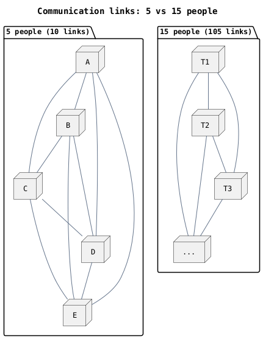

There's a version of ambition that equates scale with success. More headcount, more processes, more layers of approval. I used to believe this. Building something with fifty people felt more serious than building it with five.

I've changed my mind.

The best work I've seen — and the most consequential — has come from groups small enough that everyone in the room could name everyone else in the room. Not because small teams are scrappy or cheap (though they often are both), but because of what smallness makes possible.

## What small unlocks

Communication overhead in a team scales roughly as *n(n−1)/2* — the number of possible pairings. A five-person team has ten. A fifty-person team has twelve hundred and fifty. The arithmetic alone explains why large organizations feel like they move through water.

But it's subtler than bandwidth. In a small team, context travels whole. When a decision gets made, the people who need to know about it usually already know, because they were in the room, or because the person who decided told them at lunch. In large teams, decisions escape their context. They become policy, memo, changelog entry — stripped of the reasoning that made them sensible.

This matters enormously for technical work, where so much depends on shared mental models. The best codebase I've ever maintained was one written by four people over three years. Not because the code was clever — it was often deliberately plain — but because every person in the room had touched every part of it, and that shared familiarity meant changes were fast, regressions were caught, and trade-offs were explained rather than imposed.

## The honest costs

None of this is free. Small teams are vulnerable. Lose one person and you've lost twenty percent of your capacity and an irreplaceable chunk of context. Vacations are complicated. Illness is complicated. Growth feels precarious.

Small teams also tend to underinvest in documentation, because the context lives in people rather than paper. This is mostly fine until it isn't — until someone leaves, or the team needs to grow quickly, or the CEO asks a question that nobody anticipated.

You can mitigate these risks — write things down, build strong hiring pipelines, design systems that outlast their authors — but you can't eliminate them. At some point, something you built small will need to become medium, and that transition is genuinely hard.

## When to grow

The answer isn't to stay small forever. It's to stay small until the work demands otherwise — and to be honest about which demand is driving the decision.

Growing because the work is bigger than five people can handle is good. Growing because it looks impressive, or because other teams are bigger, or because you want to give someone a promotion and adding a layer feels easier than the conversation — those are the ones that tend to cost you later.

The teams I've admired most knew when they were the right size. That's rarer than it sounds.

---

*TODO: Miquel — rewrite this with your own examples and voice. The structure is a scaffold, not a final draft.*
